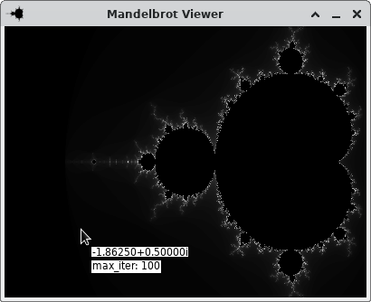
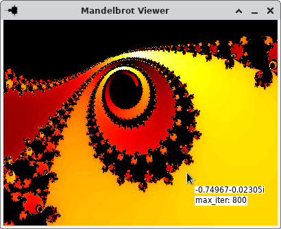
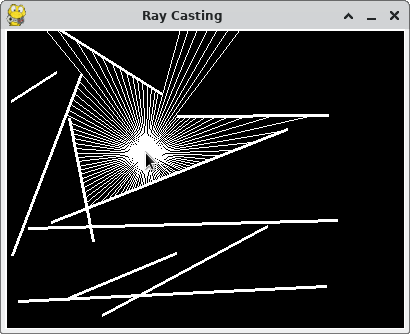

# FunKode

A repository in which I have fun with Python code!

## Setup

First, clone the git repository:

```bash
git clone https://www.github.com/UltimateTimmeh/funkode <FUNKODE_ROOT>
```

Next, set up the virtual environment and install FunKode as a package in editable mode:

```bash
cd <FUNKODE_ROOT>
virtualenv -ppython3 .venv
source .venv/bin/activate
python -m pip install -e .
```

## Usage

### Mandelbrot Viewer

Interactively explore the wonderful fractals of the Mandelbrot set. Move around, zoom in/out
and take screenshots with different color palettes. For example:




Launch with the following command:

```bash
mandelbrot
```

### Ray Casting

Move the mouse and watch as rays are emitted from it and stop at the first randomly generated
wall they encounter.



Launch with the following command:

```bash
raycasting
```

## Ideas for future fun

Here are some ideas for topics to explore in the future:

- **3D Rendering with ray casting** - To create Doom-like scenarios (the game).
- **Smart Rockets** - Genetic algorithm in which rockets automatically learn to hit a target.
- **Mandelbulb** - This groovy 3D object first requires exploring the following:
  - *Signed Distance Functions*
  - *Ray Marching*
